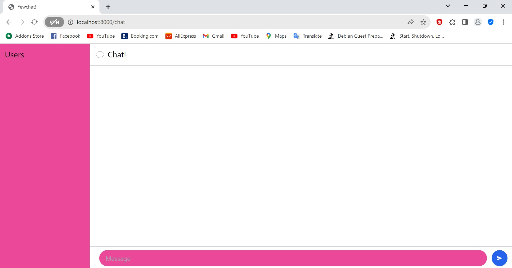

## 3.1 Original Code
Mengawali tutorial dengan melakukan clone dari dua repo yang tertera pada panduan yaitu https://github.com/jtordgeman/YewChat/tree/websockets-part2 dan https://github.com/jtordgeman/SimpleWebsocketServer dan mengikuti guideline yang ada

## 3.2 Be Creative
